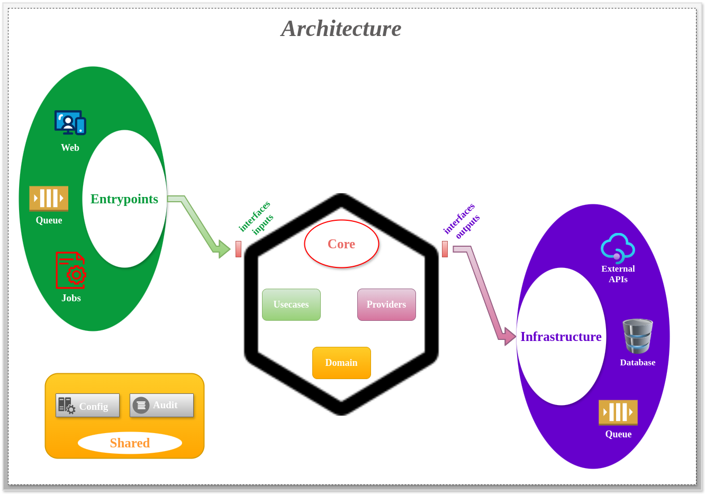

# TIMESHEET-IN-TRANSIT-API

<p align="center">
  <a href="http://nestjs.com/" target="blank"></a>
</p>


<p align="center">
  
  
  
  
</p>

### Documentação disponível em idiomas

[](README.md)
[](README.pt-br.md)

## Introdução

Este projeto foi desenvolvido com fins didáticos para explorar o framework **NestJS**. Ele serve como um estudo prático
para "*adaptar*" conceitos como **Clean Architecture** e **Hexagonal Architecture**, promovendo **boas práticas de design de
software**, com uma clara separação de responsabilidades e abstração das dependências externas.


<p align="center">
  
</p>

## 1. Requisitos de Instalação

Para rodar o projeto, você precisará dos seguintes requisitos:

* **Sistema Operacional**: Linux Ubuntu / Mint
* **Docker**: Certifique-se de ter o Docker instalado na sua máquina.
* **Docker Compose**: Instale o Docker Compose para orquestrar os containers.
* **Makefile**: Certifique-se de ter o Makefile instalado para facilitar a execução de comandos.
* **MongoDB**: Versão 8.x do MongoDB com container docker.
* **NodeJs**: Versão 22.x do NodeJs com container docker.
* **NodeJs**: Versão 20.x do NodeJs instalado na máquina local.
* **Yarn**: Versão 1.22.x do Yarn instalado na máquina local.

## 1.1. Estrutura do Projeto

Este projeto se assemelha muito à **Clean Architecture** e à **Hexagonal Architecture**, pois promove uma clara
separação de responsabilidades e abstração das dependências externas.
Isso facilita a manutenção, escalabilidade e testabilidade, além de permitir que a aplicação evolua sem impactos diretos
nas regras de negócios centrais.

A divisão ocorre em três módulos principais, cada um com uma responsabilidade específica:

```lua
timesheet-in-transit-api/
│-- app/
│   │-- src/
│   │   │-- app.module.ts
│   │   │-- database.module.ts
│   │   │-- index.ts
│   │   │-- main.ts
│   │   │-- seed.module.ts
│   │   │-- seed.ts
│   │   │-- entrypoints/
│   │   │   │-- consumers/
│   │   │   │-- web/
│   │   │   │   │-- config/
│   │   │   │   │-- rest/
│   │   │   │   │-- shared/
│   │   │-- core/
│   │   │   │-- domain/
│   │   │   │   │-- entities/
│   │   │   │   │-- enums/
│   │   │   │   │-- exceptions/
│   │   │   │-- providers/
│   │   │   │   │-- config-env/
│   │   │   │   │-- integrations/
│   │   │   │   │-- queue/
│   │   │   │   │-- repositories/
│   │   │   │-- usecases/
│   │   │   │   │-- auth/
│   │   │   │   │-- notification/
│   │   │   │   │-- orders/
│   │   │-- infrastructure/
│   │   │   │-- config-env/
│   │   │   │-- integrations/
│   │   │   │-- queue/
│   │   │   │-- repositories/
│   │   │-- shared/
│   │   │   │-- audit/
│   │   │   │-- config/
│   │-- test/
│   │   │-- entrypoints/
│   │   │   │-- web/
│   │   │   │   │-- rest/
```

### **entrypoints**

O módulo `entrypoints` é responsável pela gestão dos pontos de entrada da aplicação, como `web`, `jobs` e
`consumers`.

**Importante**: **não deve conter regras de negócio**. Este pode ter validações de entradas de dados
de objetos de requests.

### **core**

O módulo `core` gerencia todas as regras de negócio da aplicação. Algumas diretrizes importantes:

- Este módulo deve ser **autônomo** e **sem dependências externas**.
- Não utilize **frameworks** ou **bibliotecas externas** diretamente no `core`.
- A pasta **domain** dentro do módulo contém as entidades e regras de negócio em nível mais granular.
- **Comunicação de saída** para sistemas externos deve ser feita através das interfaces definidas no módulo `providers`.
- **Comunicação de entrada** deve ocorrer através das interfaces do módulo `usecases`.

### **infrastructure**

O módulo `infrastructure` gerencia a comunicação externa da aplicação, como:

- **Conexões com Bancos de Dados**
- **Integrações com APIs**
- **Mensageria**

**Importante**: O módulo `infrastructure` **não deve conter regras de negócio**.

### **shared**

O módulo `shared` contém funcionalidades e utilitários que são compartilhados entre as camadas **entrypoints** e
**infrastructure**. Ele deve ser usado para incluir funcionalidades que não envolvem regras de negócios, como validações
de entrada, manipulação de erros comuns, e outras utilidades de integração externa.

**Importante**: A camada **core** não deve fazer uso do módulo `shared`, pois a lógica de negócio deve permanecer
independente de funcionalidades externas.


## 2. Passos para Rodar o Projeto

### 2.1. Iniciando o Projeto em Modo Desenvolvimento

Siga os passos abaixo para rodar o projeto em modo desenvolvimento.

#### 2.1.1. Criar alias comando docker compose cli:

- Recomendamos criar uma **alias** `dcli` para executar o comando:  `docker compose -f docker-compose.cli.yml run --rm`

```bash
  chmod +x ./add_alias_cli.sh && ./add_alias_cli.sh
```

#### 2.1.2. Configurando aws cli:

- Instale e configure o [aws cli](https://docs.aws.amazon.com/cli/latest/userguide/getting-started-install.html):

```bash
   curl "https://awscli.amazonaws.com/awscli-exe-linux-x86_64.zip" -o "awscliv2.zip"
   unzip awscliv2.zip
   sudo ./aws/install
```

- Configurando região da aws:

```bash
  nano ~/.aws/config
```

```textmate
[default]
region = us-east-1
output = json
```

- Configurando credenciais da aws (opcional):

```bash
  nano ~/.aws/credentials
```

```textmate
[default]
aws_access_key_id = <aws_access_key_id>
aws_secret_access_key =  <aws_secret_access_key>
```

#### 2.1.3. Copiar o arquivo de configuração:

- Copie o arquivo `.env.dist` para `.env` com o comando:

```bash
  cp .env.dist .env
```

### 2.2. Iniciar o projeto com Docker usando os comandos:

- Cria a rede Docker necessária para o projeto:

```bash
  make create-network
```

- Constrói as imagens Docker:

```bash
  make build
```

- Instala as dependências do projeto:

```bash
  make install
```

- Atualiza as dependências do projeto:

```bash
  make upgrade-lib
```

- Popula o banco de dados com dados iniciais:

```bash
  make seed
```

- Inicia container docker do mongodb:

```bash
  make mongodb
```

- Inicia container docker do localstack:

```bash
  make localstack-dev
```

- Cria filas no localstack:

```bash
  make create-queue-local
```

- Inicia a aplicação no modo desenvolvimento:

```bash
  make dev
```

- Executa lint e formatação do código:

```bash
  make lint-format
```

- Gera índices automaticamente (se necessário):

```bash
  make generate-index
```

- Gera arquivos de teste automaticamente:

```bash
  make generate-test-file
```

- Executa testes:

```bash
  make test
```

- Executa testes de cobertura:

```bash
  make test-coverage
```

- Executa para adicionar nova dependência com o `yarn`:

```bash
  dcli yarn add <your_dependency>
```

### 2.3. Documentação

O projeto inclui várias formas de documentação acessíveis localmente:

- [Swagger UI - Interface Interativa](http://localhost:3000/swagger-doc)
- [Swagger JSON - Documento Swagger](http://localhost:3000/swagger-doc-json)
- [Health Check - Verificação de Saúde da Aplicação](http://localhost:3000/health)

#### 2.3.1. Diagramas

Para melhor compreensão do fluxo da aplicação, consulte os diagramas abaixo:

- [Diagrama](diagram/README.md)